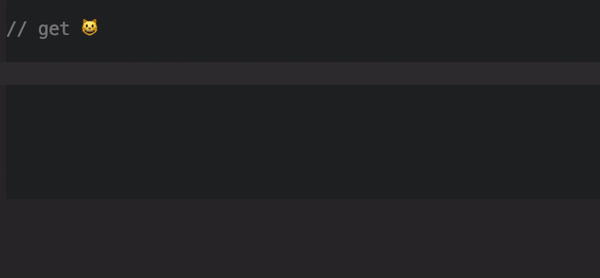

# Emoji
Easy Emoji Library  

### Usage
    $emoji = Emoji::getInstance();
    
    $emoji->emojiName;
    $emoji::category(emojiName);
    $emoji::category()->emojiName;
    $emoji::category::subCategory(emojiName);
    $emoji::category::subCategory()->emojiName;

### Todo
- Twig integration
- symfony bundle
- Custom emoji management 